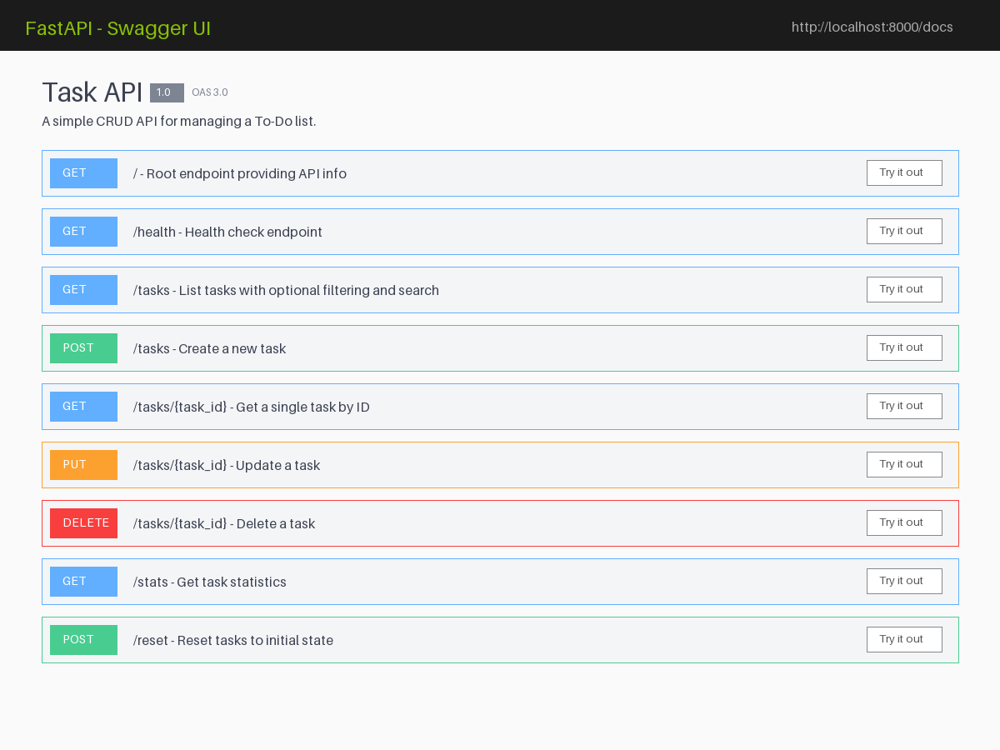

# To-Do List CRUD API (FlyRank Internship Backend Track - W2-A1)

A lightweight, high-performance RESTful CRUD API for managing a To-Do list, built with **Python 3.10+** and **FastAPI**.

---

## 🚀 How to Install & Run

1. **Clone the repository:**
   ```bash
   git clone <YOUR_GITHUB_REPO_URL>
   cd todo-crud-api
   ```

2. **Set up virtual environment & install dependencies:**
   ```bash
   python -m venv .venv
   source .venv/bin/activate  # On Windows: .venv\Scripts\activate
   pip install "fastapi[standard]" pydantic pytest httpx
   ```

3. **Start the API server:**
   ```bash
   fastapi dev main.py
   # Or using uvicorn directly:
   # uvicorn main:app --reload --port 8000
   ```

The server will run on `http://localhost:8000`.

---

## 📋 Endpoints Overview

| Method | Endpoint | Description | Status Code (Success / Error) |
| --- | --- | --- | --- |
| `GET` | `/` | API metadata & available endpoints | `200 OK` |
| `GET` | `/health` | Server health check | `200 OK` |
| `GET` | `/tasks` | List all tasks (supports `?done=true` & `?search=term`) | `200 OK` |
| `GET` | `/tasks/{id}` | Get single task details | `200 OK` / `404 Not Found` |
| `POST` | `/tasks` | Create a new task (Validates non-empty title) | `201 Created` / `400 Bad Request` |
| `PUT` | `/tasks/{id}` | Update task title and/or completion status | `200 OK` / `400 Bad Request` / `404 Not Found` |
| `DELETE` | `/tasks/{id}` | Delete a task by ID | `204 No Content` / `404 Not Found` |
| `GET` | `/stats` | View task statistics (total, done, open) | `200 OK` |
| `POST` | `/reset` | Reset in-memory task database to initial state | `200 OK` |

---

## 💻 Sample `curl` Output

**Request:** Creating a new task

```bash
curl -i -X POST http://localhost:8000/tasks \
  -H "Content-Type: application/json" \
  -d '{"title": "Complete Backend Week 2 Assignment"}'
```

**Response:**

```http
HTTP/1.1 201 Created
date: Wed, 12 Aug 2026 13:30:00 GMT
server: uvicorn
content-length: 78
content-type: application/json

{"id":4,"title":"Complete Backend Week 2 Assignment","done":false}
```

---

## 📸 Interactive Swagger UI Documentation

Access live interactive OpenAPI documentation at `http://localhost:8000/docs`.



---

## 🧪 The Mortality Experiment (In-Memory Data Observation)

* **Observation:** After creating several new tasks via `POST /tasks`, restarting the FastAPI server, and calling `GET /tasks`, all newly created tasks disappeared, and the task list reverted back to the initial 3 tasks.
* **Reasoning:** Since the data resides strictly in volatile RAM (`in-memory`), its lifecycle is tied directly to the execution process of the application. When the process terminates or restarts, all memory state is cleared. Persistent storage (such as PostgreSQL or SQLite databases) will be introduced in Week 3 to resolve this limitation.

---

## 🤖 Stage 7: AI vs Me Rematch

### Prompt Used:

> *"Build a lightweight FastAPI CRUD To-Do List API in Python. Requirements: 1) In-memory list storage with 3 default tasks. 2) Endpoints: GET /, GET /health, GET /tasks, GET /tasks/{id}, POST /tasks, PUT /tasks/{id}, DELETE /tasks/{id}. 3) Proper HTTP Status Codes: 200, 201, 204, 400 for empty/missing title validation, 404 for unknown task ID. Return JSON errors on failures."*

### Key Differences & Evaluation:

1. **What the AI did better:** The AI automatically utilized Pydantic response models (`response_model=TaskResponse`), which produced structured schemas directly in the OpenAPI documentation.
2. **What it got wrong/ignored:** The AI used a standard `HTTP 200 OK` for `DELETE /tasks/{id}` returning `{"message": "Task deleted successfully"}` instead of returning a strict `HTTP 204 No Content` as required by professional REST specifications.
3. **What the prompt forgot to specify:** The prompt did not specify edge cases for whitespace-only strings (e.g., `"   "` as a title). The AI allowed whitespace titles unless explicitly guarded with a custom field validator.
